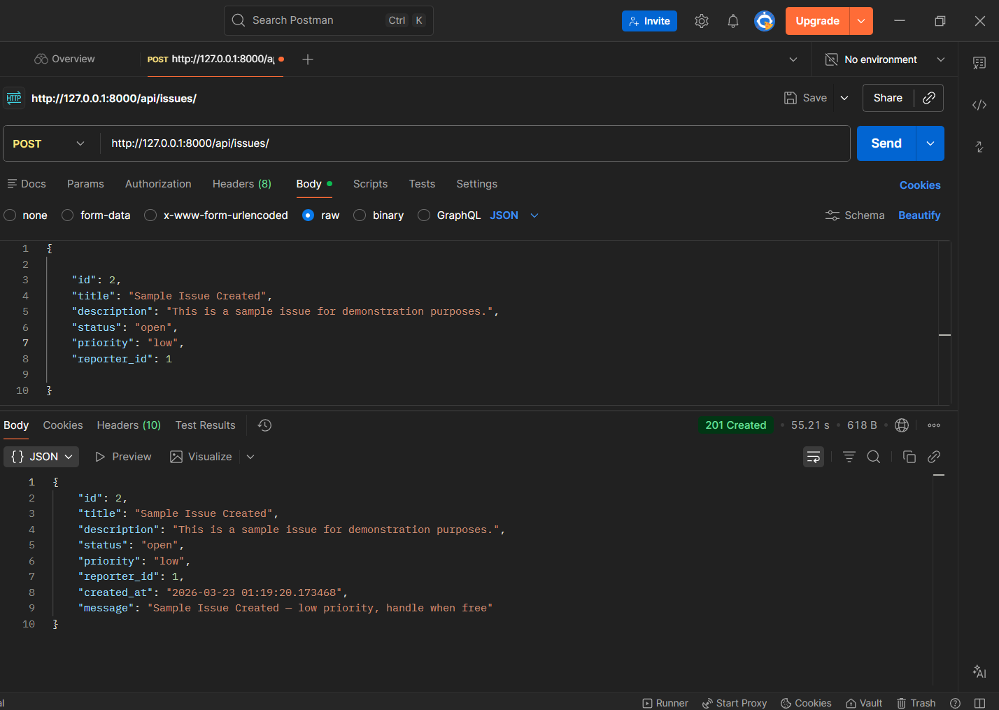
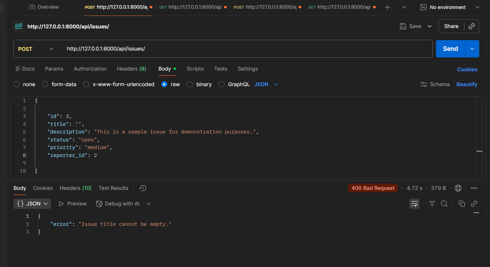
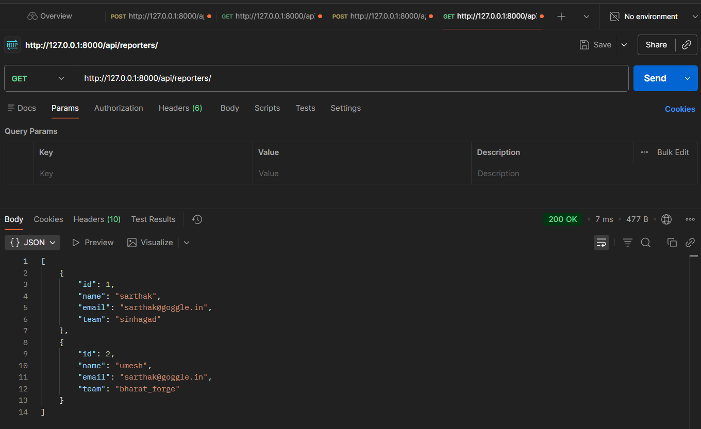
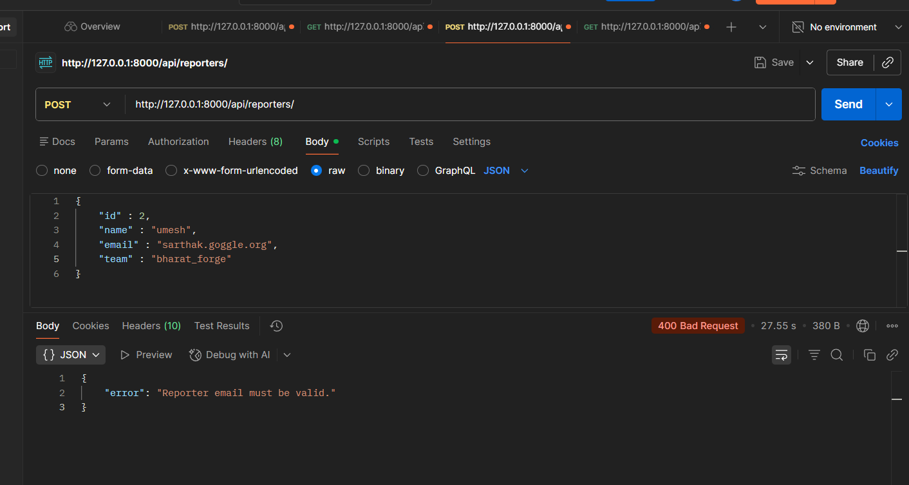

# Django-devtrack
Django app to create, view, read, issues / bugs inside a application. Back-end app to simply understand the django request and response flow.

## Features
- Create issues/bugs within an application
- View and read existing issues
- Back-end focused on Django request and response flow
- Simple understanding of Django fundamentals


## Images
- Issue created


- Issue Title empty validation 


- Get all Reporters


- Reporter email validation


- many more images under "images/" folder

# Steps to run project
- Python version 3.10+
- Django version 6.0.3 

1. Clone project
```bash
git clone https://github.com/SHRIYASH-BAND/Django-devtrack.git
cd ./Django-devtrack
```
2. Create Virtual Environment
    - Windows
    ```bash
    python -m venv venv
    venv\Scripts\activate
    ```
    - Linux/macOS
    ```bash
    python3 -m venv venv
    source venv/bin/activate 
    ```
3. Install Dependencies
```bash
pip install -r requirements.txt
```
4. Alternative dependency installation for conda environment.

```bash
conda env create -f environment.yml
conda activate task-app
```

5. Create .env file in Django-devtrack folder. Add below variables values
```txt
ISSUE_FILE='<your-directory>\Django-devtrack\data_files\issues.json'
REPORTER_FILE='<your-directory>\Django-devtrack\data_files\reporters.json'
```
6. Run project
```bash
python manage.py runserver
```


# Commands

- allow scripts to run on powershell for current session only.
    ```bash
    Set-ExecutionPolicy Bypass -Scope Process
    ```

- run project
    ```bash
    python manage.py runserver
    ```

- create django project named 'devtrack'
    ```bash 
    django-admin startproject devtrack .
    ```
- create app inside devtrack named 'issues' (command executed inside project i.e where manage.py is located)
    ```bash
    python manage.py startapp issues
    ```

    or 

    ```bash
    django-admin startapp issues
    ```